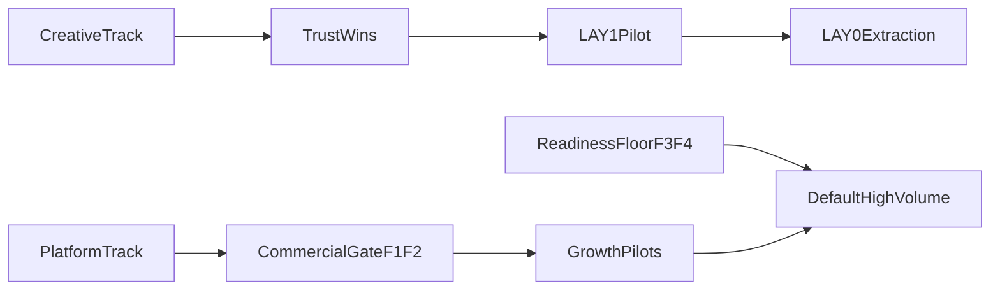

# Governed Roadmap Execution Plan

## Operating Model

Use two tracks, but only one developer-sized workstream at a time. The rule is: finish one small vertical slice, verify it, document it, then move to the next. Keep `docs/PRODUCT_IDEAS.md` as the portfolio roadmap and treat implementation status as living in commits/issues, not by constantly expanding the backlog.

Core references:
- [docs/PRODUCT_IDEAS.md](docs/PRODUCT_IDEAS.md) for governed sequence and gates.
- [docs/SCALE_PLAN.md](docs/SCALE_PLAN.md) for F2/F3/F5 data model and durability direction.
- [docs/HLD.md](docs/HLD.md) and [docs/LLD.md](docs/LLD.md) for architectural constraints.
- [web_app.py](web_app.py), [web/static/main.js](web/static/main.js), [web/static/style.css](web/static/style.css), [agents/caption_writer.py](agents/caption_writer.py), [agents/pricing.py](agents/pricing.py), and [agents/_kv.py](agents/_kv.py) as the early implementation center.

## Phase 0: Baseline And Guardrails

Goal: make sure every later change is measured against the same manual baseline.

Actions:
- Run the current compile/offline smoke loop before changing code: Python compile, one cheap story-mode preview/render path, and one brand hard-block check.
- Create a short internal checklist for every feature: estimate updates, cache behavior, story vs brand copy boundary, operator guide update, and rollback note.
- Confirm the “story-mode only” boundary for `STR-3a` posting copy and keep brand copy operator-supplied per [docs/BRAND_PLAN.md](docs/BRAND_PLAN.md).

Exit criteria:
- You know the current baseline behavior and have one repeatable smoke script/checklist to rerun after each slice.

## Phase 1: Trust Wins That Do Not Touch Spend Or Rights

Goal: improve every existing render without increasing legal, persistence, or vendor risk.

Recommended order:
- `STR-1` caption safe-zone first.
  - Backend: [agents/caption_writer.py](agents/caption_writer.py), especially caption margins/alignment.
  - UI preview: [web/templates/index.html](web/templates/index.html), [web/static/style.css](web/static/style.css), [web/static/main.js](web/static/main.js).
  - Add a regression test for bottom caption margin once the test harness exists.
- `TXT-1` keyword highlight next.
  - Keep it ASS-based in [agents/caption_writer.py](agents/caption_writer.py).
  - Use explicit operator markup, not AI-selected words for v1.
- `EDIT-1` read-only timeline strip.
  - Use existing parsed frame data in [web/static/main.js](web/static/main.js).
  - Compute timing with the current transition setting; when server-side timing is needed, align with `effective_timecodes()` / `frame_timecodes()` in [agents/assembler.py](agents/assembler.py).
- `STR-3a` posting kit.
  - Extract the `Caption:` block currently discarded by [agents/script_parser.py](agents/script_parser.py).
  - Add story-mode-only posting output: IG caption, hashtags, and cover frame selection.
  - Hard-block or hide it in brand mode.

Exit criteria:
- Existing story renders have safer captions and better operator confidence.
- No new render spend is introduced except optional cheap LLM usage for posting-kit hashtags.
- Brand ad-copy boundary is unchanged.

## Phase 2: Lightweight Editor Trust

Goal: make the product feel like a first-draft editor, not a black box.

Actions:
- Build `STR-6a` lightweight export for one finished run.
  - Persist an `edit_list.json` at the end of `_run_inner()` in [web_app.py](web_app.py).
  - Include clip paths, frame IDs, captions, durations, transition, and timing from [agents/assembler.py](agents/assembler.py).
  - Add a zip download route that packages existing `clip_*.mp4` files and the edit list.
- Build `EDIT-4` redo motion only after the export/timing model is clear.
  - Mirror the existing `/redo-still` pattern in [web_app.py](web_app.py).
  - Reuse the existing still and rebuild only the single clip, then reassemble the full output from cached/existing clips.
  - Treat lip-sync frames and unapproved Ken Burns frames as special cases.

Exit criteria:
- A completed run can be handed to a human editor without a database.
- One bad motion can be retried without regenerating the still or rerunning the whole creative pipeline.

## Phase 3: Right-Sized Test Floor

Goal: create protection before layout, spend, and consent logic grow.

Actions:
- Add a small pytest harness and fixtures.
- Prioritize pure logic tests, not full render tests:
  - Model routing in [agents/model_router.py](agents/model_router.py).
  - Pricing and approved-frame behavior in [agents/pricing.py](agents/pricing.py).
  - Parser annotations and `Caption:` extraction in [agents/script_parser.py](agents/script_parser.py).
  - Caption safe-zone and highlight escaping in [agents/caption_writer.py](agents/caption_writer.py).
  - Brand mandatories in [agents/brand.py](agents/brand.py).
- Add Flask test-client coverage for `/api/estimate` and brand hard-block behavior.

Exit criteria:
- Money, routing, parser, caption, and brand-gate regressions are caught before manual render testing.

## Phase 4: LAY-1 Pilot, Then LAY-0 Extraction

Goal: get real layout value before designing the generic system.

Actions:
- Ship `LAY-1` text card pilot first.
  - Reuse the PIL pattern from `build_cta_card()` in [agents/brand.py](agents/brand.py), or create a small [agents/layout.py](agents/layout.py) module if it keeps story/brand clean.
  - Add a minimal frame representation for text cards without committing to the full `LAY-0` schema too early.
  - Avoid double-rendering the same text as both image text and burned caption unless intentionally configured.
- After operators use the pilot, extract `LAY-0`.
  - Introduce additive `frame["layout"]` and `frame["overlays"]` keys.
  - Keep rendering centralized through one compositor path.
  - Add serialization tests before adding more presets.
- Only after extraction, add `LAY-2`, `LAY-3`, `LAY-4`, `TXT-2`, and `TXT-3` as presets.

Exit criteria:
- Text card exists as user value.
- `LAY-0` is shaped by one real case.
- No second layout preset ships before extraction.

## Phase 5: Commercial Gate F1 And F2

Goal: unlock story-intake, multi-format, multi-language, and hook workshop safely for paid/external/real-person use.

Actions:
- F1 consent and rights policy.
  - Reuse the `validate_mandatories()` pattern from [agents/brand.py](agents/brand.py).
  - Store a minimal consent record keyed to subject/project/run using [agents/_kv.py](agents/_kv.py) as the short-term store.
  - Enforce rights checklist before brand render and before real-person growth features.
- F2 spend governance.
  - Add a lightweight ledger using [agents/_kv.py](agents/_kv.py) first, aligned with the future [docs/SCALE_PLAN.md](docs/SCALE_PLAN.md) `cost_events` model.
  - Add per-project or per-session caps before a full auth/project model exists.
  - Start by gating `/run`, `/preview`, `/redo-still`, `/redo-motion`, `/generate-music`, and future posting/growth endpoints where paid calls can happen.
  - Keep `pricing.estimate()` as preflight truth and ledger rows as actual/cached truth.

Exit criteria:
- A feature that touches real people or multiplies spend can pilot commercially.
- Spend can be attributed and blocked before runaway cost.
- Consent and rights are explicit records, not tribal knowledge.

## Phase 6: Gated Growth Pilots

Goal: pilot the high-leverage growth features after F1/F2, but before default/high-volume rollout.

Recommended order:
- `STR-2` story to script intake.
  - Start with pasted long story text; add voice memo transcription later.
  - Output editable frame script, not an automatic render.
  - Require consent/rights confirmation before real-person processing at scale.
- `STR-3b` multi-format and cutdowns.
  - Start with one additional aspect or one teaser output, not all variants.
  - Ensure estimate and ledger cover each additional render/export.
- `STR-5` hook workshop.
  - Generate low-cost opener candidates first; do not animate all variants by default.
  - Treat scoring as advisory until post-publish data exists.
- `STR-4` multi-language/dubbing.
  - Pilot with translated captions first, then synthetic/regional voices.
  - Require consent confirmation because dubbing changes likeness/voice usage.

Exit criteria:
- Growth features are opt-in pilots with visible cost, consent, and operator review.

## Phase 7: Production-Readiness Floor F3 And F4

Goal: allow gated features to become default/high-volume.

Actions:
- F3 restart-safe runs.
  - Move run artifacts to persistent `HOB_RUNS_DIR` as planned in [docs/SCALE_PLAN.md](docs/SCALE_PLAN.md).
  - Persist run status, payload, logs, output path, and error trace using [agents/_kv.py](agents/_kv.py) first.
  - Add retry/re-dispatch from stored payload; rely on caches for paid-work reuse.
- F4 tests mature with every gate.
  - Add tests for ledger/cap enforcement, consent/disclosure gating, restart/retry metadata, and layout serialization.

Exit criteria:
- A server restart does not erase run visibility or force blind manual recovery.
- Gated growth features can become default or higher-volume with regression coverage.

## Phase 8: Post-DB Product Surface

Goal: build durable product features only after the data model exists.

Actions:
- `STR-7` asset library.
  - Use the [docs/SCALE_PLAN.md](docs/SCALE_PLAN.md) `assets` model: hash, S3 key, kind, description, consent flag, deletion state.
- `STR-8` brand approval/audit trail.
  - Start lightweight earlier if needed, but full signed-off version history belongs with DB-backed projects/reel versions.
- `STR-6b` full versioned project export.
  - Export from project/reel/version state, not from ephemeral run folders.
- Brand `B2-*` kinetic layer.
  - Build only after `LAY-0` exists and durable placement/versioning is available.
- Collaboration and operator identity hardening.
  - Move from light operator identity to proper auth when operator count and spend justify it.

Exit criteria:
- The product moves from single-operator tool to durable multi-user system without rewriting the engine.

## Verification Loop For Every Slice

For each implemented slice:
- Run pure tests first.
- Run server-side estimate smoke if costs are affected.
- Run one cheap Dev render or preview when visual output is affected.
- Run a brand hard-block smoke if brand/legal behavior is touched.
- Update [docs/LLD.md](docs/LLD.md) for implementation details and [docs/OPERATOR_GUIDE.html](docs/OPERATOR_GUIDE.html) / [GUIDE.md](GUIDE.md) for operator-facing behavior.
- Confirm no AI-generated brand ad copy has been introduced.

## Solo-Developer Priority Summary

Do this first:
1. Safe-zone.
2. Keyword highlight.
3. Timeline strip.
4. Posting kit story-only.
5. Lightweight export.
6. Redo motion only.
7. Test harness.
8. Text card pilot.
9. LAY-0 extraction.
10. F1/F2 commercial gate.
11. Story-intake pilot.
12. F3/F4 production floor.
13. Multi-format, hook workshop, multi-language.
14. DB-backed asset library, audit trail, versioned export, Brand B2.